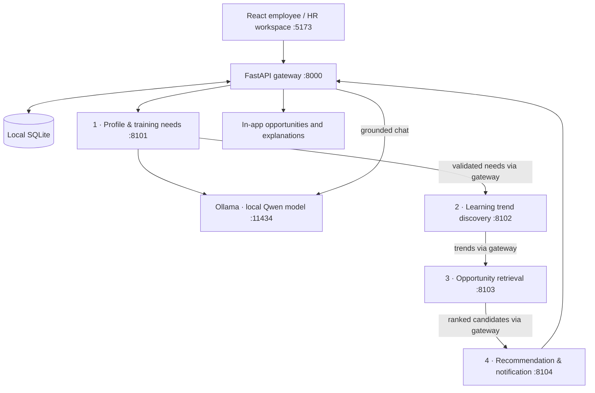

# SkillScout AI

A local employee learning assistant built for **IT3041 — Information Retrieval and Web Analytics**. Four independent agents discover skill gaps, extract learning trends, retrieve courses, and explain personalized recommendations. React + TypeScript frontend, FastAPI services, SQLite storage, and local Ollama inference.

## Run this folder in VS Code

1. Open **this entire folder** with **File → Open Folder**.
2. Open the integrated terminal (**Terminal → New Terminal**).
3. On this Mac, the dependencies and portable Ollama are installed in the project. Run:

   ```bash
   python3 scripts/dev.py
   ```

4. Open **http://127.0.0.1:5173**. Keep the terminal running. Press **Ctrl+C** to stop.

You can also choose **Terminal → Run Task → SkillScout: start**. The Python extension enables **Run and Debug → SkillScout: full system**. The launcher starts all four agents and the gateway; there is no need to manage six terminals. macOS users may double-click `Start SkillScout.command`.

### Fresh machine / cloned repository

Prerequisites: Python **3.12+**, Node.js **22.12+** with npm, and [Ollama](https://ollama.com/download). Download dependencies once:

```bash
python3 scripts/setup.py
python3 scripts/model.py --pull
python3 scripts/dev.py
```

On Windows use `python` instead of `python3`. The setup/model/dev scripts and VS Code tasks select `.venv/Scripts/python.exe` automatically. macOS has been exercised locally; Windows portability is implemented but not independently verified.

`setup.py` creates `.venv`, installs pinned Python requirements and locked npm dependencies, and copies `.env.example` to `.env` only if `.env` does not already exist. It preserves existing data. Model download uses the local Ollama server and the configured model. On a fresh machine, install Ollama before the model step. A copied virtual environment or `node_modules` directory is not portable; rerun setup after cloning.

### Accounts

All three demo accounts use **`SkillScout123!`**. The login page can fill these credentials.

| Account | Role | Access |
|---|---|---|
| `alex@skillscout.demo` | Employee | Data Analyst → Data Scientist; all personal learning features |
| `hr@skillscout.demo` | HR / L&D | Organization aggregates, course catalogue |
| `admin@skillscout.demo` | Administrator | Organization aggregates and course/post ingestion |

Register a new employee account to test onboarding. New accounts start with consent off; fill in a professional profile and explicitly enable analysis. Demo profiles contain fictional data and are preconfigured for the demonstration.

## What works

- Cookie-based login/registration, role checks and private per-user data.
- Editable role, skills, career goal, experience, certifications, learning history, time and budget.
- Four authenticated HTTP worker services with recorded inputs, outputs, timings and failure traces.
- Local language-model decisions with validated structured responses and visible fallback mode.
- Skill/entity extraction, topic co-occurrence and comparative 14-day trend windows with source evidence.
- BM25 + TF-IDF cosine retrieval, explicit course search, category/level/type/free filters.
- Personalized course ranking with factor scores, prerequisite guidance, offer expiry and explanations.
- Save → in progress → completed learning plan, in-app notifications, and opt-in scheduled discovery.
- Grounded Ask Scout answers with retrieved catalogue sources.
- HR aggregate learning analytics, admin course and learning-post ingestion.
- Data export, consent withdrawal and account deletion with password confirmation.

No paid API key is needed. The system remains usable when Ollama is absent, with its deterministic mode clearly shown. **For the assignment's LLM requirement, demonstrate a run whose profile agent shows `llm_used: true` and a successful local-model chat.** A reachable server alone is not evidence that inference was used.

## Architecture



The gateway orchestrates sequential agent calls; workers do not directly call one another. Each runs in a separate process and communicates over HTTP/JSON using `X-Agent-Key`. Role-specific handlers share reusable engine code. This is a bounded, goal-directed agent workflow with an optional scheduler, not an unrestricted autonomous web-browsing agent.

See [architecture and methodology](docs/ARCHITECTURE.md), [security and Responsible AI](docs/RESPONSIBLE_AI.md), and [demonstration/submission guide](docs/DEMO_AND_SUBMISSION.md).

## Model and data provenance

The default model is **`qwen2.5:3b`**, about 1.9 GB, served through Ollama's [chat endpoint](https://docs.ollama.com/api/chat). It uses the [Qwen Research License](https://ollama.com/library/qwen2.5:3b); review that license before commercialization. A different installed Ollama model can be selected in `.env` using `OLLAMA_MODEL`. Re-run `scripts/model.py --pull` after changing it.

This Mac has a project-local Ollama executable under `.local/ollama` and models under `.local/models`. The runner reuses an already-running Ollama server; otherwise it prefers this portable executable, then an installed `ollama`. Locally started servers set `OLLAMA_NO_CLOUD=1`. An existing server keeps its own settings and model store. Model setup and dev startup use the same selection rule.

Courses reference public provider pages, but the seeded course metadata, durations, ratings, prices and discounts are **demonstration records**, not verified current offers. Learning posts are **synthetic**, not scraped LinkedIn profiles. The UI labels this data. External provider pages are the place to verify actual availability and prices. Admin-added records must include source details and an explicit demo flag; marking a record non-demo does not independently verify it.

The catalogue and posts seed once into the local database. Their timestamps do not advance every restart. Expired discounts are removed from displayed effective offers; old posts naturally age out of trend windows. Add recent source material through the admin screen for a later demo. To start a separate fresh demo without losing existing work, set `SKILLSCOUT_DB_PATH` to a new filename in `.env`.

## Checks

See [local validation results and limits](docs/VALIDATION.md) for the completed checks.

macOS/Linux commands (Windows: replace `.venv/bin/python` with `.venv\Scripts\python.exe`):

```bash
.venv/bin/python -m pytest
.venv/bin/python -m backend.evaluation
npm --prefix frontend run build
```

With the system running, in another terminal:

```bash
.venv/bin/python scripts/smoke.py --require-llm
```

The smoke check uses real HTTP services, creates a disposable employee, validates consent, runs all four agents, exercises search/chat/course progress/RBAC/export, and deletes that account. Leave off `--require-llm` only when deliberately testing fallback. Login/registration rate limits apply to smoke checks too.

## Serve the built app

```bash
npm --prefix frontend run build
python3 scripts/dev.py --production
```

Open **http://127.0.0.1:8000**. Here `--production` means serving compiled frontend files on one local origin; it is not a claim of enterprise production readiness. The normal development URL is port **5173**, which proxies `/api` to port **8000**.

## Configuration and troubleshooting

- Settings: `.env` (see `.env.example`). Restart services after changes.
- Database: `data/skillscout.db`. Passwords are hashed; the database itself is not encrypted.
- Worker key: generated at `.local/agent.key` with restricted file permissions.
- Logs: `.local/logs/{gateway,profile,trends,retrieval,recommendations,frontend,ollama}.log`.
- “Port already in use”: stop the previous launcher with Ctrl+C before starting another. Required ports are 8000, 8101–8104, 5173, and 11434 for Ollama.
- “Model unavailable”: run `python3 scripts/model.py --pull`, check `.env`, and allow up to 20 seconds for status-cache refresh. First inference can take longer while loading the model.
- “Profile changed”: a saved profile or completed course invalidates old analysis. Run discovery again.
- Disable scheduled checks during an isolated demo with `SKILLSCOUT_SCHEDULER_ENABLED=false`; manual discovery still works.
- Only loopback addresses are bound. Use the same hostname consistently, preferably `127.0.0.1`, so the session cookie remains on one origin.
- Built app gives a missing-UI message: run the frontend build before `--production`.

Do not expose this demo's known credentials to the internet. External email/Teams/LMS/HRIS integrations, live platform crawling, multi-tenant billing, encryption at rest and enterprise deployment are future commercialization work; this implementation delivers local in-app notifications and aggregate organization analytics.

## Repository and coursework

```text
backend/ai/        NLP, retrieval, model interface and scoring
backend/data/      Demonstration catalogue and synthetic posts
backend/api.py     Gateway and employee/HR/admin endpoints
backend/worker.py  Authenticated worker entry point
backend/db.py      SQLite repository
backend/evaluation.py  Repeatable labelled retrieval evaluation
frontend/src/      React workspace
scripts/          Setup, launcher, model setup and live smoke test
tests/            AI and API regression tests
docs/             Methodology, Responsible AI and submission support
.vscode/          Run, debug, setup and test tasks
```

Before GitHub upload, use the included `.gitignore`: it excludes secrets, databases, models, virtual environments, dependencies and generated files. GitHub upload is not part of local setup and has not been performed. Add your actual group member names, student IDs and contribution records before submission; do not attribute generated scaffolding as work a member did not perform. Use your lecturer's final report template and record your own 3–5 minute video.
